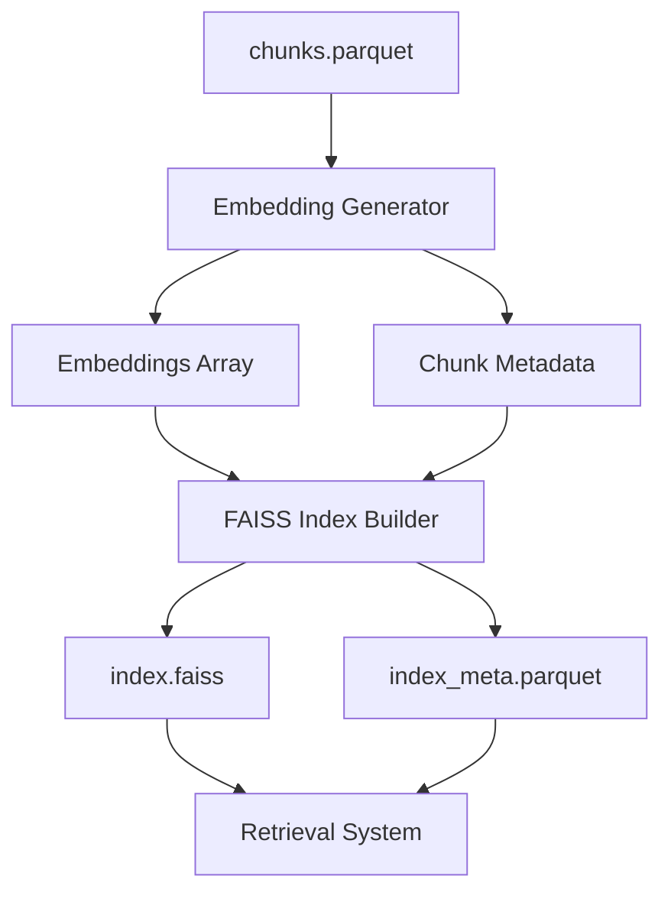

# Design Document: Embeddings and FAISS Index

## Overview

This design implements a vector embedding and FAISS indexing system for the Med RAG application. The system will process text chunks from the ingestion pipeline, generate semantic embeddings using the BAAI/bge-small-en-v1.5 model, and build a FAISS index for efficient similarity search. The implementation follows the existing project architecture patterns and integrates seamlessly with the current data processing pipeline.

## Architecture

The embeddings and FAISS index system consists of three main components:

1. **Embedding Generator**: Converts text chunks to 384-dimensional vectors using sentence-transformers
2. **FAISS Index Builder**: Creates and manages the vector similarity search index
3. **Pipeline Integration**: Connects with existing ingestion workflow and provides foundation for retrieval



## Components and Interfaces

### Embedding Generator

**Purpose**: Generate vector embeddings from text chunks using sentence-transformers

**Key Methods**:
- `load_model()`: Initialize the BAAI/bge-small-en-v1.5 model
- `generate_embeddings(chunks: List[str]) -> np.ndarray`: Process text chunks in batches
- `process_chunks_file(input_path: Path) -> Tuple[np.ndarray, pd.DataFrame]`: Main processing function

**Configuration**:
- Model: BAAI/bge-small-en-v1.5 (384 dimensions)
- Batch size: 32 (configurable based on available memory)
- Device: Auto-detect GPU/CPU availability

### FAISS Index Builder

**Purpose**: Create and manage FAISS index for efficient similarity search

**Key Methods**:
- `create_index(embeddings: np.ndarray) -> faiss.Index`: Build appropriate FAISS index
- `save_index(index: faiss.Index, path: Path)`: Persist index to disk
- `save_metadata(metadata: pd.DataFrame, path: Path)`: Store chunk metadata

**Index Selection Logic**:
- For datasets < 10,000 chunks: `IndexFlatIP` (exact search, inner product)
- For datasets 10,000-100,000 chunks: `IndexIVFFlat` with 4*sqrt(N) clusters
- For datasets > 100,000 chunks: `IndexIVFFlat` with optimized cluster count

### Pipeline Integration

**Purpose**: Integrate with existing data processing workflow

**Key Methods**:
- `validate_inputs()`: Check for required input files and dependencies
- `create_output_directories()`: Ensure output paths exist
- `main()`: Orchestrate the complete embedding and indexing process

## Data Models

### Input Data Structure
```python
# From chunks.parquet
ChunkData = {
    "chunk_id": str,      # Format: "{doc_id}::c{index:04d}"
    "doc_id": str,        # Document identifier
    "title": str,         # Document title
    "page_start": int,    # Starting page number
    "page_end": int,      # Ending page number
    "chunk_text": str     # Text content for embedding
}
```

### Output Data Structures
```python
# Embeddings array
embeddings: np.ndarray  # Shape: (n_chunks, 384)

# Metadata for index mapping
IndexMetadata = {
    "chunk_id": str,
    "doc_id": str,
    "title": str,
    "page_start": int,
    "page_end": int,
    "chunk_text": str,
    "embedding_index": int  # Position in FAISS index
}
```

### FAISS Index Configuration
```python
# Index types based on dataset size
if n_chunks < 10_000:
    index = faiss.IndexFlatIP(384)  # Exact search
elif n_chunks < 100_000:
    nlist = max(100, int(4 * math.sqrt(n_chunks)))
    index = faiss.IndexIVFFlat(faiss.IndexFlatIP(384), 384, nlist)
else:
    nlist = max(1000, int(16 * math.sqrt(n_chunks)))
    index = faiss.IndexIVFFlat(faiss.IndexFlatIP(384), 384, nlist)
```

## Correctness Properties

*A property is a characteristic or behavior that should hold true across all valid executions of a system-essentially, a formal statement about what the system should do. Properties serve as the bridge between human-readable specifications and machine-verifiable correctness guarantees.*

### Property Reflection

After reviewing the prework analysis, I identified several properties that can be consolidated:
- Properties 1.1 and 2.1 both test core functionality and can be combined into a comprehensive embedding-to-index property
- Properties 2.4 and 1.3 both test metadata preservation and can be combined
- Properties 5.1 and 5.5 both test processing behavior and can be combined into batch processing properties

### Correctness Properties

Based on the prework analysis, the following properties ensure system correctness:

**Property 1: Embedding Generation Completeness**
*For any* valid text chunk from chunks.parquet, the Embedding_Generator should produce a 384-dimensional vector embedding and preserve all original metadata fields
**Validates: Requirements 1.1, 1.3**

**Property 2: Index Construction and Searchability**
*For any* set of embeddings, the FAISS_Index should create a searchable index that can perform similarity searches and return valid results
**Validates: Requirements 2.1, 2.5**

**Property 3: Index Type Selection**
*For any* dataset size, the FAISS_Index should select the appropriate index type (IndexFlatIP for <10k chunks, IndexIVFFlat for larger datasets)
**Validates: Requirements 2.2**

**Property 4: Metadata Preservation Through Pipeline**
*For any* chunk processed through the embedding pipeline, the output metadata should contain all original fields plus the embedding index position
**Validates: Requirements 2.4**

**Property 5: Batch Processing Consistency**
*For any* configurable batch size, processing chunks in batches should produce identical results to processing them individually
**Validates: Requirements 5.1**

**Property 6: Directory Creation**
*For any* missing output directory path, the Vector_Store should create the directory structure automatically before processing
**Validates: Requirements 3.3**

**Property 7: Resumption Behavior**
*For any* existing output files, rerunning the embedding process should skip already processed chunks and produce consistent results
**Validates: Requirements 5.5**

**Property 8: Change Detection**
*For any* modification to chunks.parquet (newer timestamp), the system should detect the change and rebuild embeddings accordingly
**Validates: Requirements 6.2**

## Error Handling

The system implements comprehensive error handling following the existing project patterns:

### Input Validation Errors
- **Missing chunks.parquet**: Raise `SystemExit` with descriptive message
- **Corrupted input data**: Validate parquet file structure and content before processing
- **Empty dataset**: Handle gracefully with appropriate logging

### Model Loading Errors
- **Model download failures**: Retry with exponential backoff, fallback to cached model
- **GPU/CPU compatibility**: Auto-detect and fallback to CPU if GPU unavailable
- **Memory constraints**: Implement adaptive batch sizing based on available memory

### Processing Errors
- **Individual chunk failures**: Log error with chunk_id context, continue processing remaining chunks
- **Batch processing failures**: Reduce batch size and retry, escalate if persistent
- **Disk space issues**: Check available space before processing, fail early with clear message

### Index Building Errors
- **FAISS index creation failures**: Validate embedding dimensions and data types
- **Index serialization errors**: Verify write permissions and disk space before saving
- **Metadata consistency**: Validate embedding count matches metadata count

## Testing Strategy

The testing approach combines unit tests for specific functionality with property-based tests for universal correctness guarantees.

### Unit Testing
Unit tests will focus on:
- **Configuration loading**: Verify settings are loaded correctly from environment
- **Model initialization**: Test embedding model loading and basic functionality
- **File I/O operations**: Test reading chunks.parquet and writing output files
- **Error conditions**: Test specific error scenarios (missing files, corrupted data)
- **Integration points**: Test pipeline integration and script execution

### Property-Based Testing
Property-based tests will validate universal properties using the **Hypothesis** library for Python:
- **Minimum 100 iterations** per property test to ensure comprehensive coverage
- **Custom generators** for creating valid chunk data, embeddings, and metadata
- **Shrinking strategies** to find minimal failing examples when properties fail

Each property test will be tagged with:
**Feature: embeddings-and-faiss-index, Property {number}: {property_text}**

### Test Configuration
```python
# Property test settings
@given(chunks=chunk_data_strategy())
@settings(max_examples=100, deadline=30000)  # 30 second timeout
def test_embedding_generation_completeness(chunks):
    # Test implementation
    pass
```

### Integration Testing
- **Pipeline integration**: Test embedding generation as part of full ingestion pipeline
- **Performance benchmarks**: Validate processing speed meets acceptable thresholds
- **Memory usage**: Monitor memory consumption during large dataset processing
- **GPU utilization**: Verify GPU acceleration when available

The testing strategy ensures both correctness (through property-based tests) and reliability (through comprehensive unit tests) while maintaining the existing project's testing patterns and quality standards.